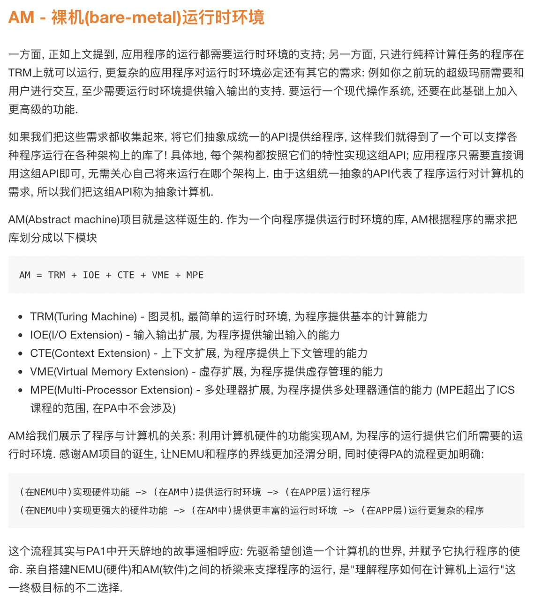
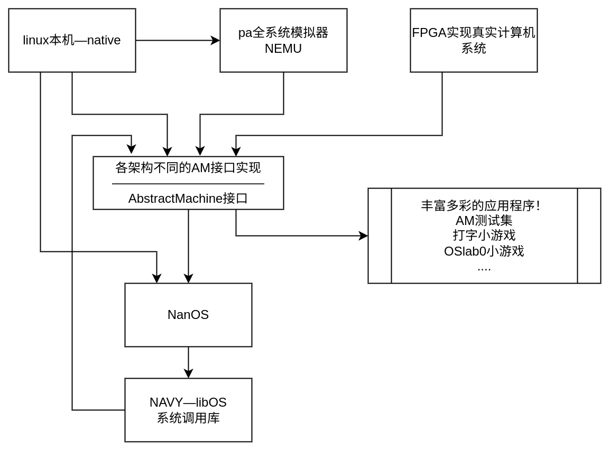
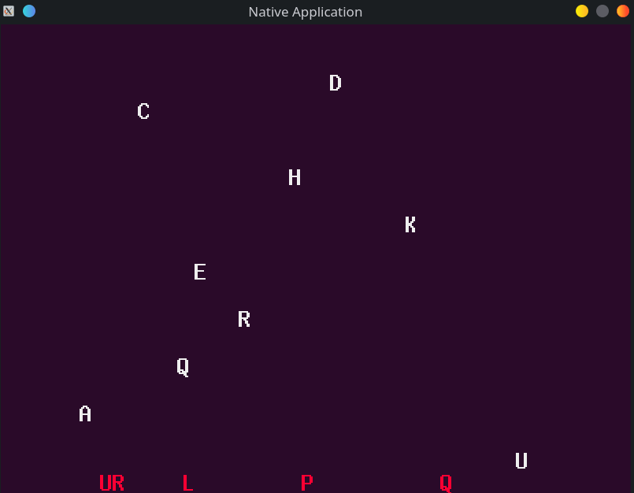
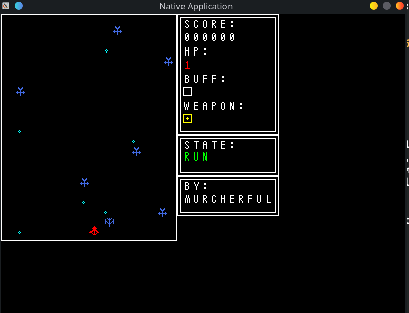
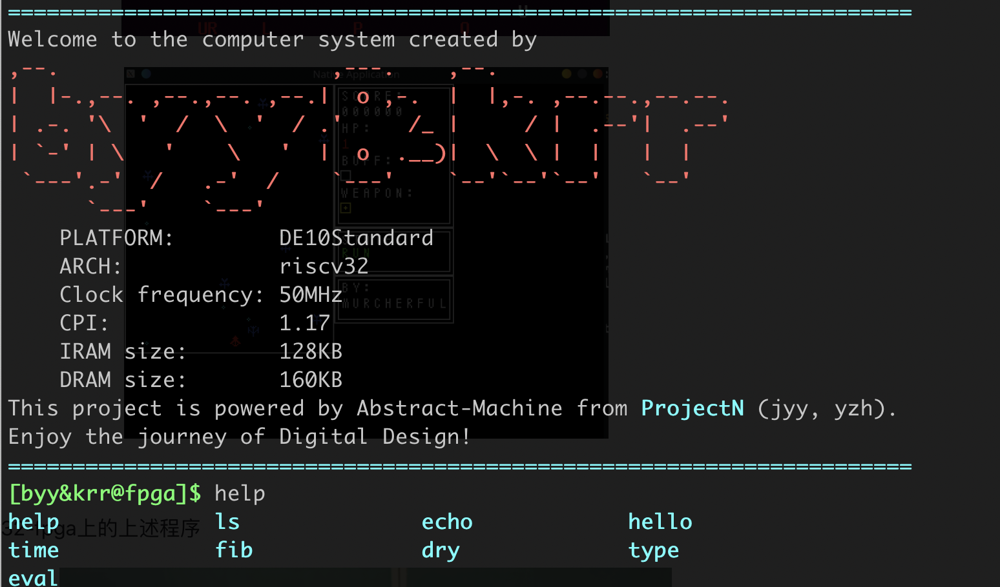
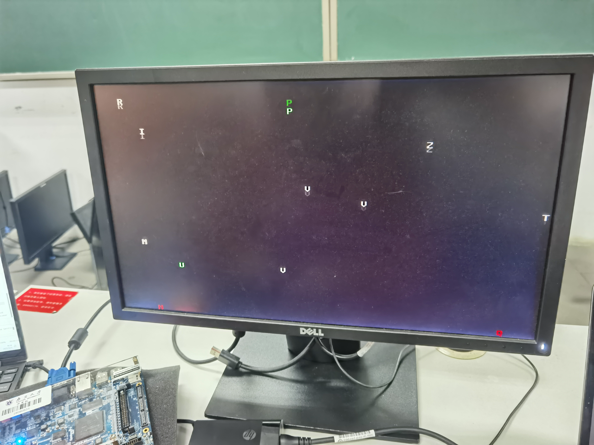
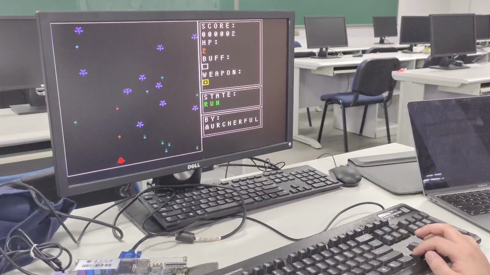
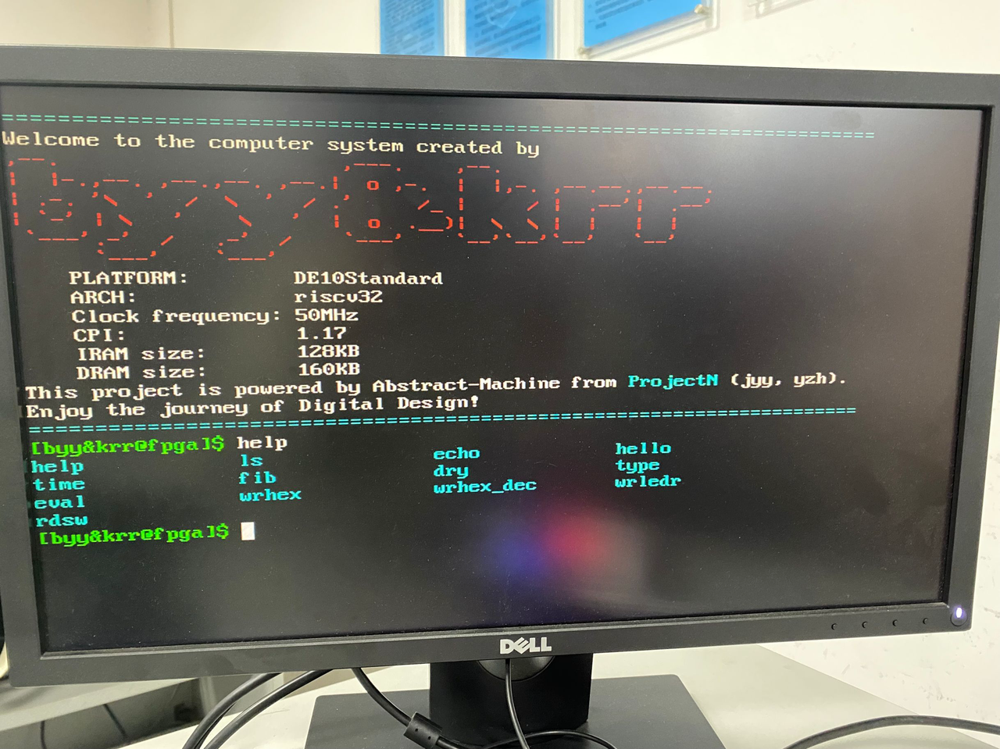

成功实现了CPU，我们就有了一台可以不断取指令执行的图灵机了！



项目地址[NJU-ProjectN (github.com)](https://github.com/NJU-ProjectN)

以上内容摘自pa讲义，本实验中成功实现了TRM与IOE两部分。

有了AM环境，丰富多彩的应用程序得以运行在各种各样的不同架构中。



AM通过不同架构之间的解耦，使得同一份程序可以运行在多种多样的平台。因此，我甚至可以之间在开发板上见证“来自未来的应用程序”——学长学姐在操作系统课是完成的OSlab0小游戏。这绝对是一趟穿越时空的奇幻旅程！

不仅如此，由于

> 机器永远是对的——

> 但是，我创造的计算机可不一定（

通过将应用程序在本机与fpga上分别运行，我们可以轻易定位bug出现的层次（应用程序层 or AM层 or 硬件层），快速完成功能开发与调试工作。

运行在linux- native架构上的打字小游戏，OSlab0小游戏与MyTerm程序







hby同学经过PA的洗礼，很容易将AM移植到了FPGA上。

运行在riscv32-fpga上的上述程序








### FPGA_ARCH_AM的特征

> 该部分代码主要位于`./am_home`中

AM中包含了基本的运行时环境库。

- `am_home/am`中包含与架构联系紧密的c代码库，包括TRM，IOE
- `am_home/klib`中包含与架构无关的c代码库，例如printf，strcmp等libc函数

其中，需要将TRM中的_start函数放到0x0地址处，完成TRM的初始化工作，这里的解决方案为将_start符号放置到特殊的entry节中，而在链接合并text节的过程中，将刚刚的entry节放到开始位置。

start.S(`./am_home/am/src/start.S`)

```assembly
.section entry, "ax"
.globl _start
.type _start, @function

_start:
  li sp, 0x01023ffc
  jal _trm_init
```

链接脚本(`./am_home/scripts/linker.ld`)

```shell
ENTRY(_start)
OUTPUT_FORMAT("elf32-littleriscv")

SECTIONS {
    . = 0x00000000;
    .text : {
        *(entry)
        *(.text*)
        *(text_end)
    }
    ...
}
```

并且，为了完成架构解耦，makefile也包含了PA中的本机AM环境，这样就可以在本机运行AM程序。

```Makefile
ifeq ($(ARCH),native)

-include $(AM_HOME)/Makefile

else
...
endif
```

同时，为了提高构建到上板运行构成的自动化，makefile添加了自动更新到quartus目录mif文件的规则

```Makefile
update: dump
    @echo "UPDATE" $(shell realpath $(EXEC).mif --relative-to .) $(shell realpath $(EXEC)_d.mif --relative-to .)
    @cp $(EXEC).mif $(CPU_FPGA_PATH)/imem.mif
    @cp $(EXEC)_d.mif $(CPU_FPGA_PATH)/dmem.mif
```

有了这个makefile，对于一个特定的应用程序，只需将在应用目录下包含该makefile，即可完成在am运行时环境下的项目构建。

### AM应用构建过程

> dummy代码位于`./am_kernel/dummy`中

对于一个dummy应用，首先确定名称与构建源码集，再去包含$MYCPU_AM_HOME中的makefile

```Makefile
NAME     := dummy
SRCS      = $(shell find . -name "*.c" -or -name "*.S")

include $(MYCPU_AM_HOME)/makefile
```

AM的makefile位于(`./am_home/makefile`)

之后，再根据AM的makefile根据构建规则，执行以下构建过程

> 设置初始构建变量：初始名称、编译文件集、应用include_path、CFLAG宏定义标志选项等
>
> ```makefile
> NAME = dummy
> SRCS = dummy.c
> ```
>
> 根据架构包含am里边的makefile
>
> ```makefile
> include $(MYCPU_AM_HOME)/makefile
> ```
>
> > 选择构建目标，构建elf，生成mif文件还有直接更新到项目文件夹中
> >
> > **dummy(_d).mif** <\=\=objdump/objcopy\=\= ** dummy.elf**
> >
> > > **dummy.elf** <\==ld\== **\$OBJS(= dummy.o) \$LIBS(=am.a klib.a)**
> > >
> > > > **$OBJS(= dummy.o)** <\==AS/CC/CXX\== **%.c/...($SRCS= dummy.c)**
> > > >
> > > > **$LIBS(am(.a) klib(.a))** <\==make -C ... archive\== **进入相关lib目录，构建archive静态链接库目标**
> > > >
> > > > > **$ARCHIVE(am.a klib.a)** <\==AR\== **$OBJS(lib中make_srcs中规定的构建文件)**
> > > > >
> > > > > 重复对静态链接库中**$OBJS**的构建规则

相似的过程，我们可以完成丰富多彩的应用程序在fpga架构上的构建