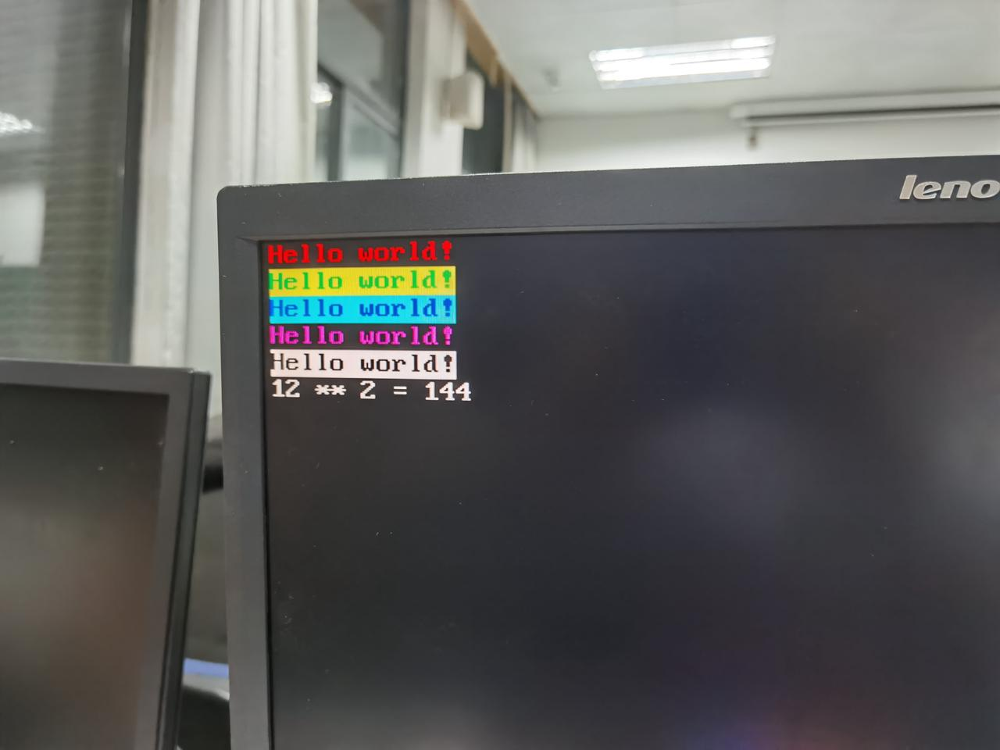
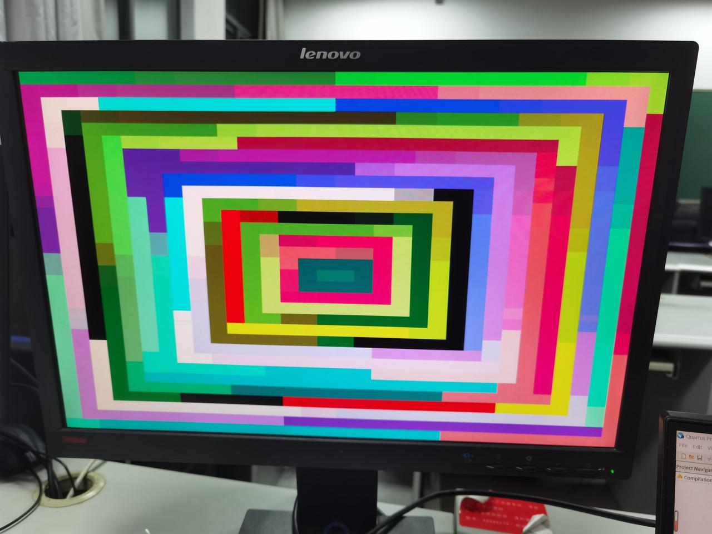

> 该部分代码中
>
> 硬件部分主要位于`./hardware_src/quartus_core/mycpu.v`中
>
> am部分主要位于`./am_home/am/include`, `./am_home/am/src/fpga-ioe`与`./am_home/am/src/am-ioe`中

这里采用了内存映射I/O（MMIO），通过不同的物理内存地址给设备编址的，硬件根据地址将数据与控制信号分配给相应IO设备。CPU只需要对内存地址进行读写操作，实际上与IO设备交互了数据，CPU却浑然不知。

### 分别在软硬件完成对IO地址映射

硬件完成地址映射

```verilog
parameter   dmem_mem  = 4'd1,
            dmem_kbd  = 4'd2,
            dmem_vga  = 4'd3,
            dmem_hex  = 4'd4,
            dmem_ledr = 4'd5,
            dmem_sw   = 4'd6,
            dmem_key  = 4'd7,
            dmem_clk  = 4'd8,
            dmem_vga_ctrl= 4'd9,
            dmem_gmem  = 4'd10;

wire [3:0] dmem_tag;
assign dmem_tag = dmemaddr[27:24];
```

软件完成地址映射，并进一步封装

```C
//ioe
#define MEM_ADDR      (0x01000000)
#define KBD_ADDR      (0x02000000)
#define VMEM_ADDR     (0x03000000)
#define HEX_ADDR      (0x04000000)
#define LEDR_ADDR     (0x05000000)
#define SW_ADDR       (0x06000000)
#define KEY_ADDR      (0x07000000)
#define CLK_ADDR      (0x08000000)
#define CLK_US_ADDR   (CLK_ADDR+0x0)
#define CLK_MS_ADDR   (CLK_ADDR+0x4)
#define CLK_DS_ADDR   (CLK_ADDR+0x8)
#define CLK_S_ADDR    (CLK_ADDR+0xc)
#define VGA_CTRL      (0x09000000)
#define FB_ADDR       (0x0a000000)
```

这里，为了避免编译器对地址操作的优化，需要用`volatile`关键字进行修饰，并封装IO操作函数

```C
static inline uint8_t  inb(uintptr_t addr) { return *(volatile uint8_t  *)addr; }
static inline uint16_t inw(uintptr_t addr) { return *(volatile uint16_t *)addr; }
static inline uint32_t inl(uintptr_t addr) { return *(volatile uint32_t *)addr; }

static inline void outb(uintptr_t addr, uint8_t  data) { *(volatile uint8_t  *)addr = data; }
static inline void outw(uintptr_t addr, uint16_t data) { *(volatile uint16_t *)addr = data; }
static inline void outl(uintptr_t addr, uint32_t data) { *(volatile uint32_t *)addr = data; }
```

### FPGA特有IO接口

#### 1. HEX — 七段数码管（只写）

这里在内存地址映射了一个uint_8类型数组，每个元素取低4位作为七段数码管输出。

硬件实现

```verilog
reg [3:0] hex_data [5:0];
always @(posedge dmemwrclk) begin
    if(dmemwe)begin
        if(dmem_tag==dmem_hex && dmemaddr[2:1]!=2'b11) hex_data[dmemaddr[2:0]] <= dmemdatain[3:0];
    end
end

hex7seg my_hexout[5:0](
    .en(6'b111111),
    .b({hex_data[5], hex_data[4], hex_data[3], hex_data[2], hex_data[1], hex_data[0]}),
    .h({HEX5, HEX4, HEX3, HEX2, HEX1, HEX0})
);
```

软件实现

```c
static void HEX_WR(uint8_t wridx, uint8_t wrval){
    outb(HEX_ADDR + (uintptr_t)wridx, wrval);
}
```

#### 2. LEDR — LED灯（只写）

这里在内存地址映射了一个uint_16类型变量，取低10位作为LED灯输出。

硬件实现

```verilog
reg [9:0] ledr_data;
assign LEDR = ledr_data[9:0];
always @(posedge dmemwrclk) begin
    if(dmemwe)begin
        if(dmem_tag==dmem_ledr) ledr_data <= dmemdatain[9:0];
    end
end
```

am接口实现

```C
static inline void LEDR_WR(uint16_t wrval){
    outw(LEDR_ADDR, wrval);
}
```

#### 3. SW — 开关（只读）

硬件实现

```verilog
always @(*) begin
    case(dmem_tag)
        dmem_sw:   dmemdataout = {22'd0, SW};
        ...
    endcase
end
```

软件实现

```C
static inline uint16_t SW_RD(){
    return inw(SW_ADDR);
}
```

### AM通用IOE接口

#### 1. 时钟（只读）

硬件计时器地址映射

```verilog
clkcount #(1000000) clk_us(
    .clkin(CLOCK_50),
    .clkcount(dmem_clks_out[0])
);

clkcount #(1000) clk_ms(
    .clkin(CLOCK_50),
    .clkcount(dmem_clks_out[1])
);

clkcount #(10) clk_ds(
    .clkin(CLOCK_50),
    .clkcount(dmem_clks_out[2])
);

clkcount #(1) clk_s(
    .clkin(CLOCK_50),
    .clkcount(dmem_clks_out[3])
);

always @(*) begin
    case(dmem_tag)
        dmem_clk:  dmemdataout = dmem_clks_out[dmemaddr[3:2]];
        ...
    endcase
end
```

封装读取时间接口

```C
static inline uint32_t CLK_US_RD(){
    return inl(CLK_US_ADDR);
}
static inline uint32_t CLK_MS_RD(){
    return inl(CLK_MS_ADDR);
}
static inline uint32_t CLK_DS_RD(){
    return inl(CLK_DS_ADDR);
}
static inline uint32_t CLK_S_RD(){
    return inl(CLK_S_ADDR);
}
```

实现AM时钟寄存器接口

```C
void __am_timer_uptime(AM_TIMER_UPTIME_T *uptime) {
  volatile uint64_t res;
  ((uint32_t*)&res)[0] = CLK_US_RD();
  ((uint32_t*)&res)[1] = ((uint64_t)CLK_S_RD() * 15625) >> 26;
  uptime->us = res;
}
```

#### 2. 键盘（只读）

由于实验7中的ps2键盘模块本身是由缓冲区队列实现的，这里只需做一些封装。收到CPU的“内存读”信号，数据线上传递按键扫描码，去自动移动队列头指针，若无按键则直接返回0。

```verilog
always @(negedge dmemrdclk) begin
    if(nextdata_n == 1'b0) nextdata_n <= 1'b1;
    else if(ps2_ready && dmem_tag == dmem_kbd && dmemrd) nextdata_n <= 1'b0;
end
ps2_keyboard myps2(
    .clk(dmemrdclk),
    .clrn(1'b1),
    .ps2_clk(PS2_CLK),
    .ps2_data(PS2_DAT),
    .data(keycode_data),
    .ready(ps2_ready),
    .nextdata_n(nextdata_n)
);
assign dmem_keycode = ps2_ready && nextdata_n ? keycode_data : 8'd0;
always @(*) begin
    case(dmem_tag)
        dmem_kbd:  dmemdataout = {24'd0, dmem_keycode};
        ...
    endcase
end
```

对于具体按键的提取，我们采用软件识别扫描码的方式实现。这里构建了一个按键码状态机，分析不同的扫描码，最终返回AM中的按键ID

```C
//一位按键码映射数组
uint8_t keycode2key_id[132] = {
    [0x01] = _KEY_F9,
    [0x03] = _KEY_F5,
    [0x04] = _KEY_F3,
    [0x05] = _KEY_F1,
    [0x06] = _KEY_F2,
    ....
};
//循环读取，返回按键的AMID码
uint8_t KBD_RD(){
    static uint8_t key_break = 0; // F0断码
    static bool key_sec = false;  // E0两位按键扫描码
    uint8_t keycode = inb(KBD_ADDR);
    if(!keycode) return _KEY_NONE; //无按键返回0
    if(keycode == _KEYCODE_BREAK) { //F0断码
        key_break = 0x80;  //断码最高位置1
        return _KEY_NONE;
    }
    else if(keycode == _KEYCODE_SECOND) { //E0
        key_sec = true;
        return _KEY_NONE;
    }
    uint8_t ret;
    if(key_sec) {
        switch (keycode){ //两位按键码
            ....
            case 0x7d: ret = _KEY_PAGEUP; break;
            case 0x7a: ret = _KEY_PAGEDOWN; break;
            case 0x75: ret = _KEY_UP; break;
            case 0x6b: ret = _KEY_LEFT; break;
            case 0x72: ret = _KEY_DOWN; break;
            ....
        }
    }
    else { // 一位按键码查表
        ret = keycode2key_id[keycode];
    }
    ret |= key_break; //若为断码，ID最高位置1
    //清空状态机
    key_break = 0;
    key_sec = false;
    return ret;
}
```

最后，实现AM按键寄存器接口

```C
void __am_input_keybrd(AM_INPUT_KEYBRD_T *kbd) {
  uint32_t keycode = KBD_RD();
  // 在存在按键的情况下，若最高位为1，则为keyup，否则为keydown
  kbd->keydown = keycode && ((keycode & _KEYID_BREAK_MASK) != _KEYID_BREAK_MASK);
  // 按键码为低7位
  kbd->keycode = keycode & ~_KEYID_BREAK_MASK;
}
```

同时，这里还提供了字符按键通码AMID转ascii的映射数组

```C
char key_id2ascii[NR_KEY] = {
    ....
    [_KEY_1] = '1',
    [_KEY_2] = '2',
    ....
    [_KEY_A] = 'a',
    [_KEY_B] = 'b',
    [_KEY_C] = 'c',
    ....
    [_KEY_MINUS] = '-',
    [_KEY_EQ] = '=',
    [_KEY_LEFTBRACKET] = '[',
    ...
};

char key_id2ascii_shift[NR_KEY] = {
    ....
    [_KEY_1] = '!',
    [_KEY_2] = '@',
    ....
};
```

#### 3. 字符显存（只写，支持ASNI颜色控制）

该模块在实验9的基础上增加了ASNI颜色控制码。

每一个字符占2个Byte，各位意义约定如下：

- [7:0]    字符ASCII码
- [11:8]   字符颜色码
- [15:12] 字符背景颜色码

而颜色码的各位意义如下

- [3]    ASNI字符颜色控制开启位，若该位为1，启动字符颜色控制；否则，字符为白色，背景为黑色
- [2:0] ASNI字符颜色码，从高位到低位分别为B, G, R(硬件实现需要颠倒顺序)，在颜色控制位为1时有效

按照如下约定，在硬件中完成如下映射过程。

字符显存 

​    \- 颜色码+ASCII码 -> 

字模ROM

   \- VGA坐标RGB颜色 ->

VGA输出

具体硬件实现如下

```verilog
//从字符显存中取数据
vmem my_vmem(
    .data(dmemdatain[15:0]),
    .rdaddress(vmem_rdaddress),
    .rdclock(~CLOCK_50),
    .wraddress(dmemaddr[12:1]),
    .wrclock(dmemwrclk),
    .wren(dmem_tag == dmem_vga && dmemwe),
    .q(vmem_out_data)
);

//按约定拆分字符显存数据
assign {font_bspecial, font_bspec_code,
        font_fspecial, font_fspec_code,
        vmem_ascii} = vmem_out_data;

//获取字符与背景的颜色。颜色控制位为1时，颠倒颜色位
assign font_bcolor_rgb = font_bspecial ?
                            {{8{font_bspec_code[0]}}, {8{font_bspec_code[1]}}, {8{font_bspec_code[2]}}} :
                            24'd0;
assign font_fcolor_rgb = font_fspecial ?
                            {{8{font_fspec_code[0]}}, {8{font_fspec_code[1]}}, {8{font_fspec_code[2]}}} :
                            24'hffffff;

//读取字模
vga_font my_vga_font(
    .address({vmem_ascii, font_v}),
    .clock(CLOCK_50),
    .q(font_out)
);

//根据字模为字符与背景填色
assign vga_font_data = font_out[font_h] ? font_fcolor_rgb : font_bcolor_rgb;
```

之后添加软件支持，该接口可将字符数据输出到显存对应坐标

```c
static inline void VMEM_WR(uint8_t vaddr, uint8_t haddr, uint16_t data){
    outw(VMEM_ADDR + (uintptr_t)((((vaddr<<7) | haddr)<<1)), data);
}
static inline void VMEM_WR_CH(uint8_t vaddr, uint8_t haddr, uint8_t color, uint8_t ascii){
    outw(VMEM_ADDR + (uintptr_t)((((vaddr<<7) | haddr)<<1)), 
        (uint16_t)(((uint16_t)color<<8) | ascii));
}
```

#### 4. 内置shell字符输出模块

严格来讲，该部分应当放到应用程序层当中。但是，由于输出字符是观察一个命令行程序行为的最有效的途径，是一个程序的基本需求。由于众多程序均调用了printf等函数，故将该部分放到AM-IOE层。

字符输出模块采用基于对象编程的思想，将该模块抽象为一个对象，最终封装输出单个字符的接口putch()，并且包含ASNI字符/背景颜色控制字符，退格`'\b'`等。

该模块包括以下对象。

```C
#define PAGE_HEIGHT 64
uint16_t page[PAGE_HEIGHT][VMEM_WIDTH]; // 本地字符循环缓存页面
//页面顶部与底部，采用循环设计，即计算下一行数是在PAGE_HEIGHT模意义下进行
uint8_t page_top = 0, page_bottom = VMEM_HIGHT;
//真实窗口顶部与底部，二者差值一定是屏幕字符高度
uint8_t window_top = 0, window_bottom = VMEM_HIGHT;
//当前光标坐标
uint8_t cur_vaddr = 0, cur_haddr = 0;
```

这里采用缓存页面，将字符先缓存到该数组中，当需要完成滚屏与上下翻页功能时，即可直接从缓存数组中将字符全部更新到屏幕中

封装如下接口

```C
// 扩展页面底部，若整个页面高度已超过缓冲区大小，则覆盖最上边（最早）的一行
void ext_bottem();
// 根据窗口顶部行数window_top确定窗口位置，整体更新页面
void update_vmem();
// 窗口上下滚动
bool scoll_up();
bool scoll_down();
// 光标移到下一行行首
void new_line();
// 退格
void vga_backspace();
// 在光标位置输出数据，光标自动右移
void vga_putch(uint16_t put_data);
// 窗口移动到缓存页面最底部
void window_setbottom();
// 光标左移/右移，并特殊处理行末行首
void cur_moveleft();
void cur_moveright();
```

各接口具体实现较为复杂，这里只介绍字符输出接口

```C
void vga_putch(uint16_t put_data){
    window_setbottom(); //先将窗口移动到缓存页面底部
    page[cur_vaddr][cur_haddr] = put_data; //更新缓存页面
    VMEM_WR(cur_vaddr - window_top, cur_haddr, put_data); //局部更新字符显存
    cur_moveright(); //光标右移
}

void cur_moveright(){
    ...
    cur_haddr++;
    if(cur_haddr == VMEM_WIDTH) new_line(); //若移动到行末，则新起一行
    ...
}

void new_line(){
    ...
    // 若光标已经在窗口的底部
    if((cur_vaddr+1)%PAGE_HEIGHT == window_bottom){
        ext_bottem(); // 扩展底部，若循环更新这里会清空本行
        scoll_down(); // 窗口向下滚动
    }
    //光标纵坐标模意义下加一，横坐标置0
    INC_MPH(cur_vaddr);
    cur_haddr = 0;
    ...
}
```

为了添加对ASNI控制码的支持，这里需要对vga_putch进一步封装

首先添加对ASNI控制码的声明

```C
#define ASNI_FG_BLACK   "\33[1;30m"
....
#define ASNI_FG_YELLOW  "\33[1;33m"
#define ASNI_FG_BLUE    "\33[1;34m"
....
#define ASNI_NONE       "\33[0m"
```

完成对单个字符输出接口进行封装

```C
void putch(char ch){
    static uint16_t ASNI_STATE = ASNI_CTRL_NONE;
    static uint8_t ASNI_CTRL_COLOR_TYPE = ASNI_CTRL_COLOR_NONE;
    uint16_t put_data;
    switch (ASNI_STATE){
        // 该部分用状态机维护
        ...
        case ASNI_CTRL_FGBG: // 若是颜色控制码
            if(ch>='0' && ch <= '7'){
                // 设置字符或背景颜色码
                if(ASNI_CTRL_COLOR_TYPE == ASNI_CTRL_COLOR_FG)asni_set_fg(ch-'0');
                else asni_set_bg(ch-'0');
                ASNI_STATE = ASNI_CTRL_CODE;
            } else ASNI_STATE = ASNI_CTRL_NONE;
            return;
        ...
    }
    switch (ch){
        case '\b': vga_backspace(); return; //退格字符
        case '\n': new_line(); return;      //换行字符
        case '\33':                         //ASNI控制码开始
            ASNI_STATE = ASNI_CTRL_BEGIN;
            ASNI_CTRL_COLOR_TYPE = ASNI_CTRL_COLOR_NONE;
            return;
        default: //封装颜色码，输出到字符输出模块
            put_data = ((uint16_t)asni_color<<8) | ch;
            vga_putch(put_data);
    }
}
```

这里最终完成了单个字符输出的封装工作，klib中的printf等函数可以直接调用putch()，并与本机一样可以通过ASNI控制码控制颜色，为需要调用printf的各个应用程序的移植提供便利。

ASNI输出测试

> 该部分代码主要位于`./am_kernel/asni_test`中



#### 5. 图形显存（只写）

这里实现了640\*480\*8bit的图形显存，其中只有低6bit有效，分别为2位的RGB值。

写入到显存中时需要分别取RGB数值中的高两位，输出到VGA中时需要将6位RGB值扩展到24位。

```verilog
// 计算VGA输出位置在图形显存中的位置
wire [5:0] gmem_in_data, gmem_out_data;
// 选取数值高两位
assign gmem_in_data = {dmemdatain[23:22], dmemdatain[15:14], dmemdatain[7:6]};
wire [31:0] gmem_addr_tmp, gmem_addr;
//计算v_addr*540+h_addr = {2'd0, v_addr, 7'd0} + {v_addr, 9'd0} + {9'd0, h_addr}
_32_adder vga_adder1(
    .A({15'd0, v_addr, 7'd0}),
    .B({13'd0, v_addr, 9'd0}),
    .Cin(1'b0),
    .F(gmem_addr_tmp)
);
_32_adder vga_adder2(
    .A(gmem_addr_tmp),
    .B({22'd0, h_addr}),
    .Cin(1'b0),
    .F(gmem_addr)
);
// 图像显存与内存映射
gmem my_gmem(
    .data(gmem_in_data),
    .rdaddress(gmem_addr),
    .rdclock(~CLOCK_50),
    .wraddress(dmemaddr[20:2]),
    .wrclock(dmemwrclk),
    .wren(dmem_tag == dmem_gmem && dmemwe),
    .q(gmem_out_data)
);
// 将图像显存6bit扩展到24bit
assign vga_gmem_data = {{4{gmem_out_data[5:4]}}, {4{gmem_out_data[3:2]}}, {4{gmem_out_data[1:0]}}};
```

在AM中实现图像输出控制寄存器接口。

```C
void __am_gpu_fbdraw(AM_GPU_FBDRAW_T *ctl) {
  int width = SCREEN_WIDTH;
  uint32_t *now_vmem_base = (uint32_t *)FB_ADDR + ctl->y * width + ctl->x;
  uint32_t *now_pixel_base = (uint32_t *)ctl->pixels;
  for(int i = 0; i < ctl->h; i++) {
    for(int j = 0; j< ctl->w; j++) {
        now_vmem_base[j] = now_pixel_base[j];
    }
    now_vmem_base += width;
    now_pixel_base += ctl->w;
  }
}
```

由于开发板只能将字符显存与图形显存的内容输出到同一块屏幕，这里需要一个控制寄存器来控制VGA输出选择字符显存与图形显存。

```verilog
reg vga_ctrl;
initial begin
    vga_ctrl = 1'b0;
end
always @(posedge dmemwrclk) begin
    if(dmem_tag == dmem_vga_ctrl && dmemwe) vga_ctrl <= dmemdatain[0];
end

assign vga_data = vga_ctrl ? vga_gmem_data : vga_font_data;
```

并在内存地址中映射该寄存器，软件实现相关接口

```C
static inline void VGA_FONT_ON(){
    outb(VGA_CTRL, VGA_FONT);
}
static inline void VGA_GRAPHIC_ON(){
    outb(VGA_CTRL, VGA_GRAPHIC);
}
```

移植之后，成功运行AM的VGA测试程序

> 该部分代码主要位于`./am_kernel/vga_test`中

