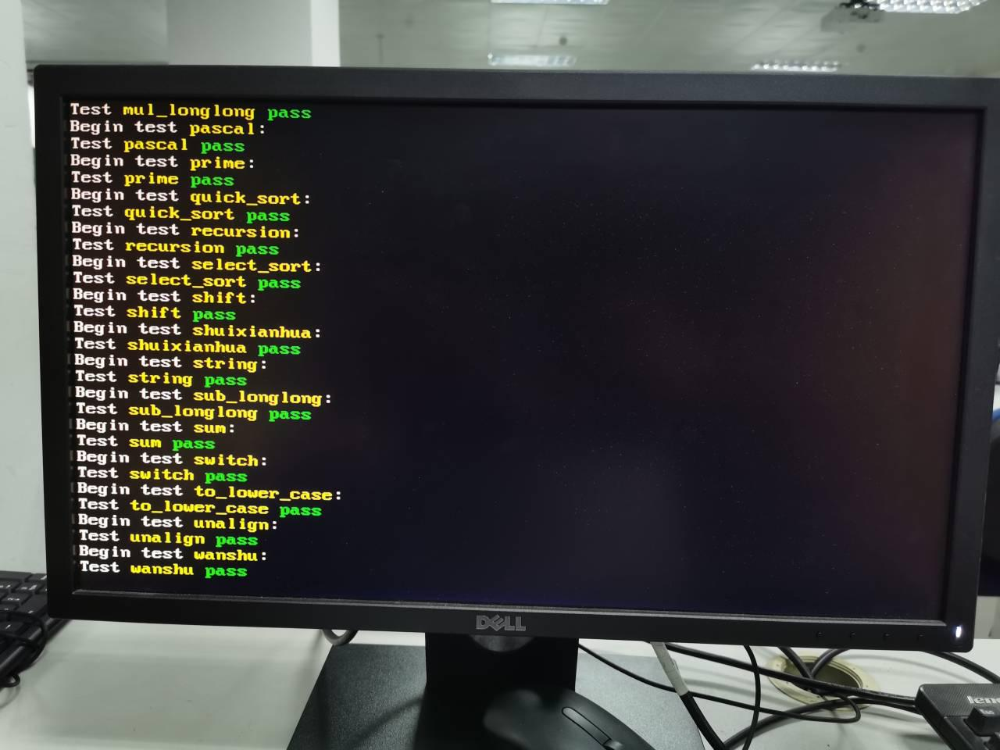

AM中提供了与架构解偶的多层次CPU测试c程序源码，这里成功移植相关测试样例。

```C
#define TEST_LIST(f) \
        f(add_longlong) f(add) f(bit) f(bubble_sort) f(div) f(dummy) \
        f(fact) f(fib) f(goldbach) f(if_else) f(leap_year) f(load_store) \
        f(matrix_mul) f(max) f(min3) f(mov_c) f(movsx) f(mul_longlong) \
        f(pascal) f(prime) f(quick_sort) f(recursion) f(select_sort)  \
        f(shift) f(shuixianhua) f(string) f(sub_longlong) f(sum) \
        f(switch) f(to_lower_case) f(unalign) f(wanshu)
```

在本地波形仿真测试中完成了对bug的调试，并在开发板上成功通过测试。

