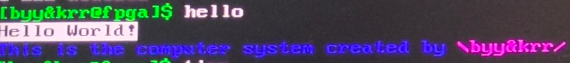
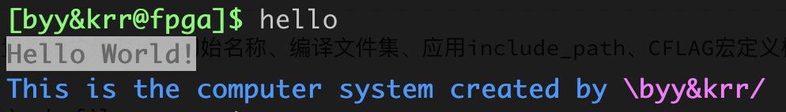
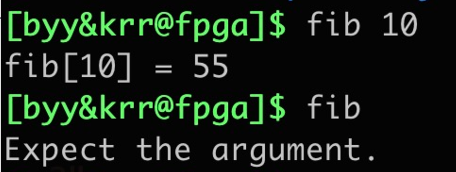
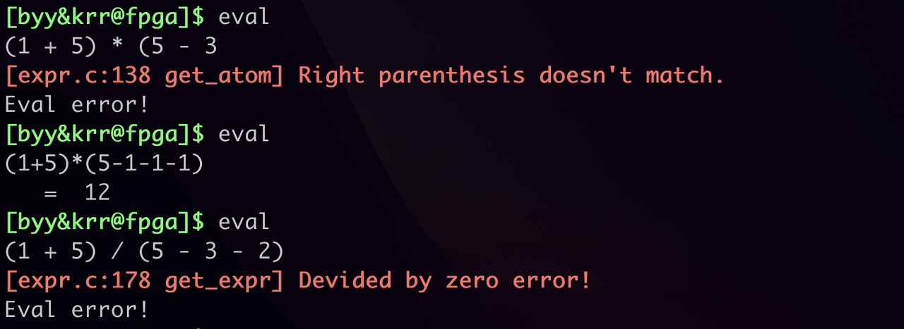
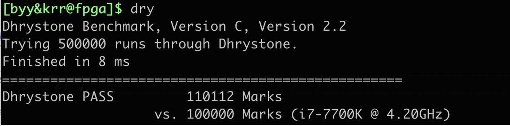
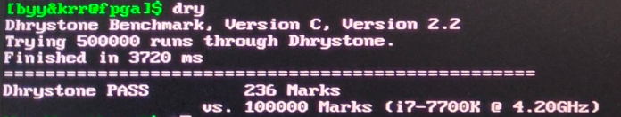
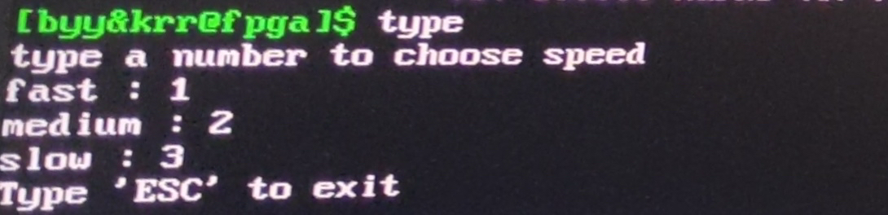
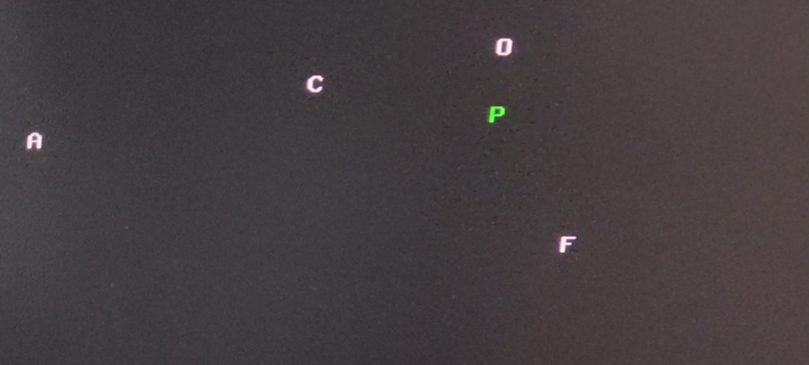
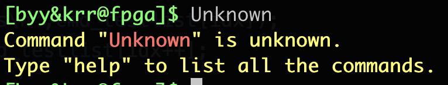

### 实验基本要求：命令行终端MyTerm

> 该部分代码主要位于`./am_kernel/myterm`中

#### 1. 调用AM接口，实现readline

> 该部分代码主要位于`./am_home/am/src/fpga-ioe/builtin_shell/readline.c`中

通过readbuf存储当前读到的字符，并通过pos_cur和pos_end记录缓冲区内光标位置与末尾位置。

```c
static char readbuf[READBUF_LEN]; 
int32_t pos_cur = 0, pos_end = 0; 
```

在AM的builtin-shell内，添加AM调用光标闪烁接口

```C
void cur_blinkon(){
    if(window_bottom != page_bottom){
        cur_blinkoff();
        return;
    }
    if(!blinkon){
        VMEM_WR(cur_vaddr - window_top, cur_haddr, 0xf000);
        blinkon = true;
    }
}

void cur_blinkoff(){
    if(blinkon){
        VMEM_WR(cur_vaddr - window_top, cur_haddr, page[cur_vaddr][cur_haddr]);
        blinkon = false;
    }
}
```

调用AM接口获取时间，每0.8秒光标闪烁一次

```C
uint32_t now_ds_time = CLK_DS_RD();
if((now_ds_time / 4) % 2 == 1) cur_blinkon();
else cur_blinkoff();
```

调用AM的KBD_RD()接口获取AM按键id，判断通码断码并进行相应的按键操作：

```c
uint8_t keyid = KBD_RD();
```

##### 1. 处理shift与caps lock按键

```C
case _KEY_LSIFHT: case _KEY_RSHIFT:   //通码
    shift_down = true;
    break;
case _KEYID_BREAK_MASK | _KEY_LSIFHT:
case _KEYID_BREAK_MASK | _KEY_RSHIFT: //断码
    shift_down = false;
    break;
case _KEY_CAPSLOCK:
    capslocked ^= 1;
    break;
```

##### 2. 处理上下左右键

- 左右键：将光标向左/右移动一位，并将pos_cur减/加一
- 上下键：将屏幕向上/下滚动

```C
case _KEY_LEFT:
    if(pos_cur != 0){
        cur_moveleft();
        pos_cur--;
    }
    break;
case _KEY_RIGHT:
    if(pos_cur != pos_end){
        cur_moveright();
        pos_cur++;
    }
    break;
case _KEY_UP: 
    scoll_up();
    break;
case _KEY_DOWN:
    scoll_down();
    break;
```

##### 3. 处理backspace

删掉光标所在位置的字符，并将字符缓存中光标之后的所有字符前移，字符缓存末尾位置减一。然后在屏幕上重新显示字符缓存，并将光标移至新位置。

```C
case _KEY_BACKSPACE:
    if(pos_cur == 0)break;
    pos_cur--;
    for(int32_t pos = pos_cur; pos < pos_end; pos++) {
        readbuf[pos] = readbuf[pos + 1];
    }
    cur_moveleft();
    for(int32_t pos = pos_cur; pos < pos_end; pos++) {
        vga_putch(readbuf[pos]);
    }
    pos_end--;
    for(int32_t pos = pos_end + 1; pos > pos_cur; pos--)cur_moveleft();
    break;
```

##### 4. 处理普通输入

对于普通按键，可以通过查表获取ascii码，并将ascii写入字符显存。

因为光标不一定在最后，所以输入后先将光标之后的字符全部后移，然后在光标处插入新字符，并将结尾位置标记加一。然后将新的字符缓存在屏幕上输出，并将光标移至新的位置。

```C
default: 
    //忽略断码
    if(keyid & _KEYID_BREAK_MASK)break;
    ascii = shift_down ? key_id2ascii_shift[keyid] :
                key_id2ascii[keyid];
    if(capslocked) {
        if(ascii >= 'a' && ascii <= 'z')ascii += 'A'-'a';
        else if(ascii >= 'A' && ascii <= 'Z') ascii += 'a'-'A';
    }
    if(ascii){ //只处理可转化为ascii码的按键
        for(int32_t pos = pos_end; pos >= pos_cur; pos--) {
            readbuf[pos + 1] = readbuf[pos];
        }
        readbuf[pos_cur] = ascii;
        pos_end++;
        for(int32_t pos = pos_cur; pos < pos_end; pos++) {
            vga_putch(readbuf[pos]);
        }
        pos_cur++;
        for(int32_t pos = pos_end; pos > pos_cur; pos--)cur_moveleft();
    }
```

#### 2. 实现简化版execv调用的功能

> 该部分代码主要位于`./am_kernel/myterm/include/myterm.h`与`./am_kernel/myterm/main.c`中

这里采用AM项目一贯的X-Macro，只需要在X-Macro_LIST中维护命令序列，即可完成命令的注册，函数声明等一些列操作。

这里通过绕开系统调用的方式，实现一个简单的execv程序执行功能。

首先，通过对X-Macro中LIST的注册，动态维护命令，模拟可执行文件在文件系统中的创建工作。

```C
// FPGA架构专属命令
#ifdef __ARCH_FPGA 
#define FPGA_EXE_LIST(f) \
        f(wrhex) f(wrhex_dec) f(wrledr) f(rdsw)
#else
#define FPGA_EXE_LIST(f)     
#endif 

// 注册命令列表
#define EXE_LIST(f) \
        f(help) f(ls) f(echo) f(hello) f(time) f(fib) f(dry) f(type) f(eval)\
        FPGA_EXE_LIST(f)
```

##### 1. 完成对所有命令执行函数的声明操作。

例如，fib命令的执行函数声明为`int exe_fib(int argc, char *argv[]);`

```C
#define DECLEAR_EXE_FUNC(name) \
        int CONCAT(exe_, name) (int argc, char *argv[]);
MAP(EXE_LIST, DECLEAR_EXE_FUNC);
```

##### 2. 对所有列表中的命令，依此赋给一个enum值。

例如，enum中fib命令的id为exe_id_fib

```C
#define DEF_EXE_ID(name) CONCAT(exe_id_, name), 
enum{ MAP(EXE_LIST, DEF_EXE_ID) nr_exe};
```

这里有个巧妙的设计，最后的nr_exe恰好就是所有指令的个数。

##### 3. 对每个命令，注册命令字符串与执行函数指针

```C
typedef int (*exe_func_type)(int argc, char *argv[]);
//可执行文件结构
typedef struct {
    char exe_name[EXE_MAX_LEN]; //命令字符串（可视为路径）
    exe_func_type exe_func; //执行函数指针
}EXE;
//完成可执行字符串与函数指针注册
#define DEF_EXE_ARR(name) \
        [CONCAT(exe_id_, name)] = { \
            .exe_name = #name, \
            .exe_func = CONCAT(exe_, name) \
        },
EXE exe_arr[nr_exe] = { MAP(EXE_LIST, DEF_EXE_ARR) };
```

这里可以顺便完成`help`基本命令的实现，输入help直接输出所有的命令的字符串

```C
int exe_help(int argc, char *argv[]) {
    for(int i = 0; i < nr_exe; i++){
        printf(ASNI_FMT("%-16s", ASNI_FG_CYAN), exe_arr[i].exe_name);
        if(i % 4 == 3)putch('\n');
    }
    if(nr_exe % 4 != 0) putch('\n');
    return 0;
}
```

##### 4. 完成shell程序具体操作

这里需要循环执行以下操作

- 输出命令提示符
- 获取命令字符串
- tokenlize
- 构建argv数组
- 查找命令程序注册表
- 调用命令执行函数

```C
welcome();
while(1){
    printf(ASNI_FMT("[byy&krr@fpga]$ ", ASNI_FG_GREEN));
    char *line = readline();
    int argc = tokenlize(line);
    if(argc == 0) continue;
    exe_func_type exe_func = unknown_cmd;
    for(int i = 0; i < nr_exe; i++){
        if(strcmp(argv[0], exe_arr[i].exe_name) == 0){
            exe_func = exe_arr[i].exe_func;
        }
    }
    exe_func(argc, argv);
}
```

其中，`tokenlize`与未知命令处理函数`unknown_cmd`实现可见源码。

之后，在应用目录中完成相关c程序的实现，并把main函数修改为相应命令执行函数符号exe_name，即可基本模拟shell程序的行为。

#### 3. 实现命令执行函数

> 该部分代码主要位于`./am_kernel/myterm/src`中

之前已经实现好了简化execv调用，可以获取输入的命令和参数，以下命令均可调用之前的接口实现

##### 1. hello

直接调用printf函数即可。

```C
int exe_hello(int argc, char *argv[]) {
    printf(ASNI_FMT("Hello World!", ASNI_FG_BLACK ASNI_BG_WHITE)"\n");
    printf(
        ASNI_FG_BLUE
        "This is the computer system created by "
        ASNI_FG_MAGENTA
        "\\byy&krr/"
        ASNI_NONE
        "\n"
    );
    return 0;
}
```

开发板上的hello命令效果：



​    本机上hello命令效果：



##### 2. time

调用AM时钟接口，输出计算开机后所经过的时间

```C
int exe_time(int argc, char *argv[]){
    uint32_t update_s = io_read(AM_TIMER_UPTIME).us / 1000000;
    printf("update time: %u(s).\n", update_s);
    return 0;
}
```

##### 3. fib n

实现简单的计算fib的函数。

```c
int exe_fib(int argc, char *argv[]) {
    if(argc == 1) {
        printf("Expect the argument.\n");
        return 255;
    }
    int n = atoi(argv[1]);
    int ans;
    if(n == 0){
        ans = 0;
    }
    else {
        int f0 = 0, f1 = 1;
        for(int i = 2; i <= n; i++){
            int tmp = f1;
            f1 += f0;
            f0 = tmp;
        }
        ans = f1;
    }
    printf("fib[%d] = %d\n", n, ans);
    return 0;
}
```



##### 4. eval

表达式求值移植自hby同学在PA1阶段实现的简易调试器，这里支持括号与嵌套，非法表达式与除零异常检测等功能。源码可见`am-kernel/myterm/src/eval.c`



##### 5. FPGA开发板相关命令

1. wrhex / wrhex_dec

输入一个16 / 10进制数，调用AM专用的接口，在开发板上的七段数码管显示相应16 / 10进制数

```C
int exe_wrhex(int argc, char *argv[]){
    if(argc == 1) {
        printf("Expect the argument.\n");
        return 255;
    }
    //htoi(char *str)将一个16进制字符串转为int
    HEX_PRINT(htoi(argv[1]));
    return 0;
}

int exe_wrhex_dec(int argc, char *argv[]){
    if(argc == 1) {
        printf("Expect the argument.\n");
        return 255;
    }
    HEX_PRINT_DEC(atoi(argv[1]));
    return 0;
}
```

2. wrledr

输入一个16进制数，调用AM专用的接口，在开发板的led上显示其二进制表示（1亮0灭）

```C
int exe_wrledr(int argc, char *argv[]){
    if(argc == 1) {
        printf("Expect the argument.\n");
        return 255;
    }
    LEDR_WR(htoi(argv[1]));
    return 0;
}
```

3. rdsw

调用AM专用接口，将开发板的开关拨出的数打印出来

```C
int exe_rdsw(int argc, char *argv[]){
    uint16_t val = SW_RD();
    printf("SW[9:0] = 0x%x\n", val);
    return 0;
}
```

##### 6. dry

移植自AM的drystone跑分程序

本机跑分



fpga跑分



##### 7. type

- 调用打字小游戏(在AM打字小游戏基础上修改而成)。将VGA模式从字符显存切换到图像显存。
- 打字小游戏：屏幕上不断落下字母，通过键盘输入字母，若屏幕上有相同字母则该字母消失，若字母落到屏幕底部仍未被击中，则miss一次
- 打字小游戏支持选择不同难度，在游戏开始前命令行输出难度选择体式，难度有三个等级，玩家可以通过键盘输入数字1，2，3选择不同难度，对应字母落下的不同速度与密度。
- 选择难度的实现：

在显存切换前，通过命令行输入难度选择提示，并接收玩家键盘输入，接收到玩家合法输入后切换显存，进入游戏。程序中设定一个变量用于更改字母下落的速度与密度，该变量随玩家输入而改变，从而实现支持玩家选择游戏难度。

- 代码位置`am_kernel/myterm/src/type.c`





##### 8. 未知命令

对于未知命令，直接输出命令未知

