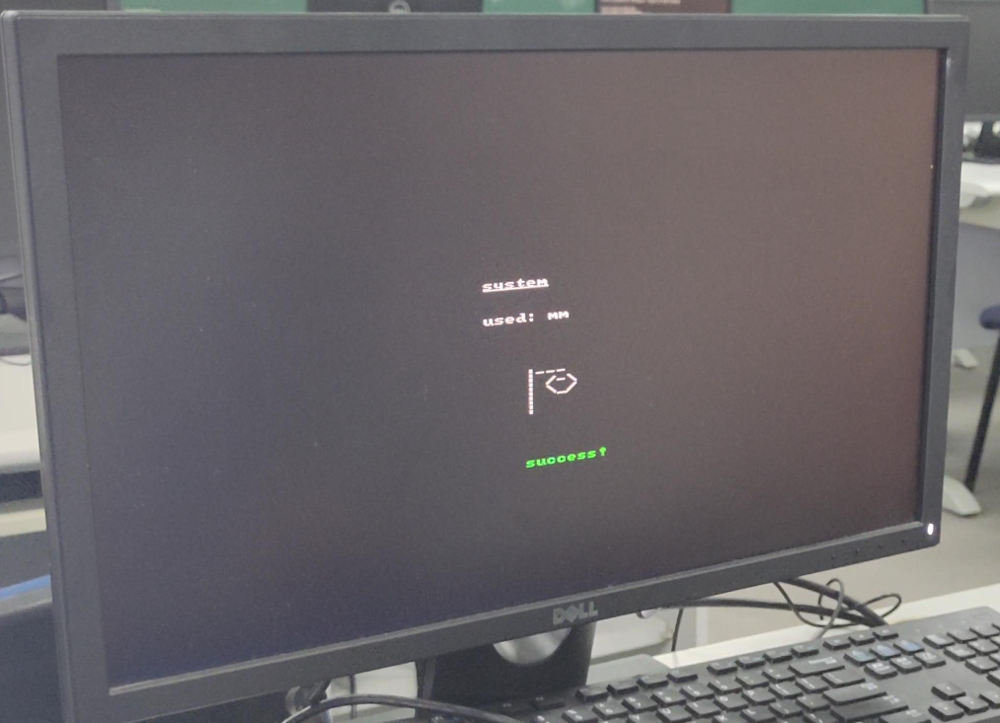
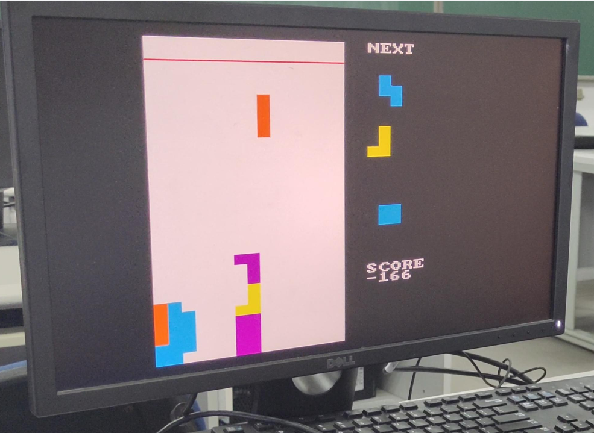
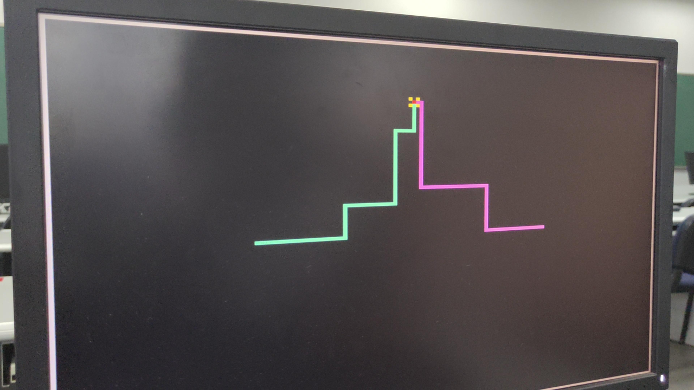
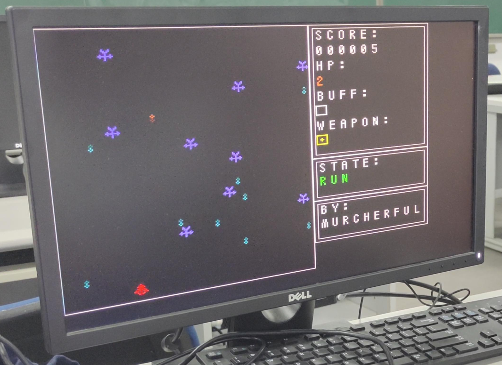
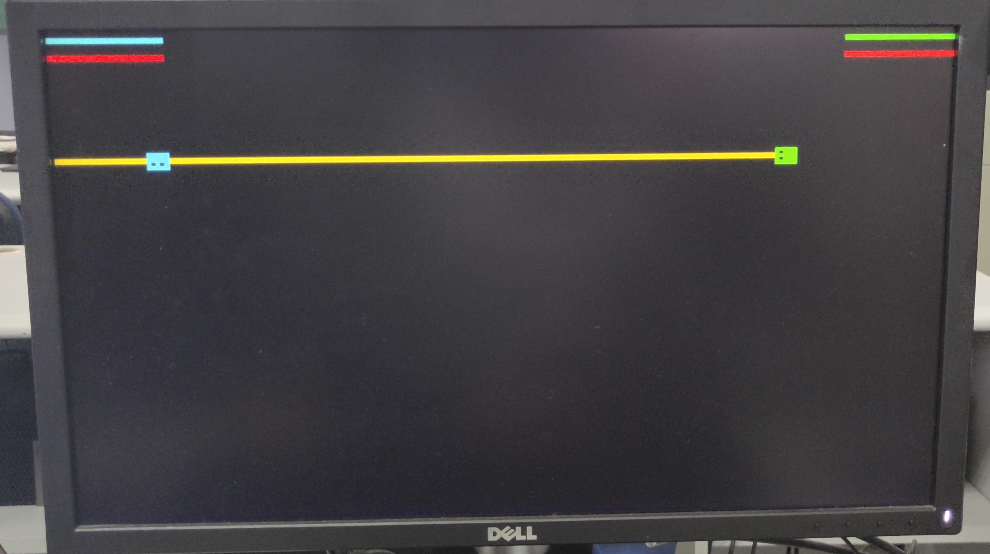
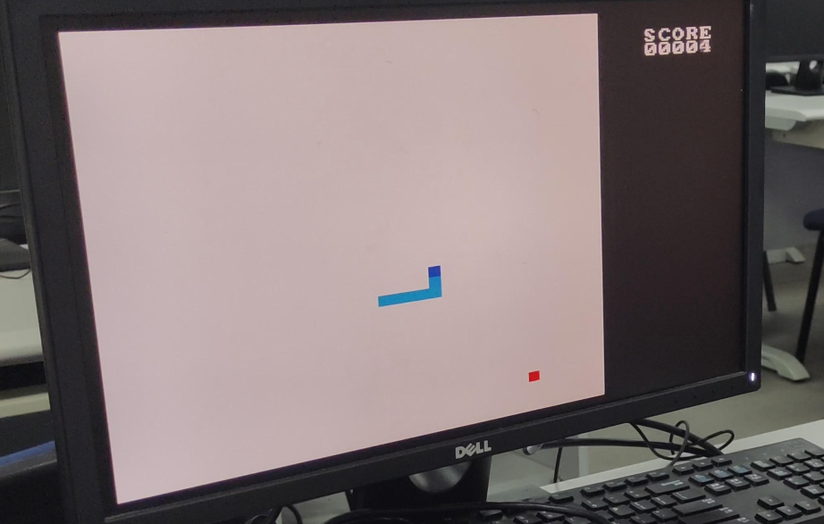

在jyy老师的操作系统课实验中，学长学姐们制作了一系列有趣的小游戏。实现AM各接口之后，将运行在AM环境中的小游戏移植到FPGA上并不困难。

猜单词小游戏

作者: 171860575, 毛一鸣

俄罗斯方块

作者: 171860508, 张天昀

飞行摩托2复刻版

作者: 171860599, 周涛

雷电

作者: 171860637

双人格斗

作者: 171240536

贪吃蛇

作者: 171860695, 梁宇方

