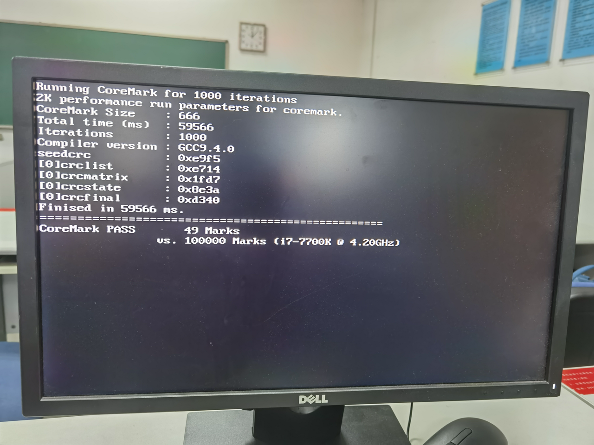

在实验11中，我们已经完成一个单周期CPU的设计与测试。有了这个CPU模块，再加上外设，我们便可以在其基础上运行指令序列，实现一个不停运转的图灵机。

由于本实验时钟频率采用分频器控制，故时钟频率有以下几档：

- 50MHz (1)
- 25MHz (1/2)
- 16.7MHz (1/3)
- 12.5MHz (1/4)
- ....

经AM项目CPU测试集测试，该单周期CPU最高频率只能达到12.5MHz。

究其原因，主要是因为CPU中的组合逻辑电路传输延迟过高，操作并行性很差，导致一个时钟周期内不能完成全部任务。

运行在单周期CPU上的coremark跑分软件

时钟频率：12.5MHz

跑分：49 Marks



因此，本实验采用了CPU设计中广泛使用的流水线设计，通过设置不同的流水段，让指令在流水线中从前往后“流动”，提高各个模块的并行性，从而提高CPU的时钟频率。

### 流水段划分与设计

上学期的数电课介绍了riscvCPU五段流水线的阶段划分

> IF(取指) -> ID/OF(译码取操作数) -> EX(执行) -> M(访存) -> WB(写回)

这里，我将取指与译码阶段合并，访存与写回阶段合并，设计如下四级流水线

> IF+ID(取指译码) -> OF(取操作数) -> EX(执行) -> M+WB(访存写回)


 这个设计在之后的仿真模拟还有巨大好处，之后介绍。

#### 流水段寄存器与冲刷信号

为了让指令在流水段之间“流动”，需要在各个流水段之间插入流水段寄存器，使得一条指令的控制信号与数据可以在下一周期内进入下一个流水段。

IF -> OF 流水段寄存器流动代码

```verilog
always @(negedge clock) begin
    IF_OF_rd <= IF_rd;
    IF_OF_rs1 <= IF_rs1;
    IF_OF_rs2 <= IF_rs2;
    IF_OF_funct3 <= IF_funct3;
    IF_OF_imm <= IF_imm;
    IF_OF_pc <= IF_pc;
    IF_OF_pc_add_4 <= IF_pc_add_4;
    IF_OF_pc_add_imm <= IF_pc_add_imm;
    IF_OF_branch_pred_jmp <= IF_branch_pred_jmp;
    IF_OF_ALUAsrc <= IF_ALUAsrc;
    IF_OF_ALUBsrc <= IF_ALUBsrc;
    IF_OF_ALUctr <= IF_ALUctr;
    IF_OF_flushed <= IF_flushnow;
    if(IF_flushnow) begin
        IF_OF_MemtoReg <= 1'b0;
        IF_OF_RegWr <= 1'b0;
        IF_OF_MemWr <= 1'b0;
        IF_OF_MemRd <= 1'b0;
        IF_OF_Branch <= 3'd0;
    end
    else begin
        IF_OF_MemtoReg <= IF_MemtoReg;
        IF_OF_RegWr <= IF_RegWr;
        IF_OF_MemWr <= IF_MemWr;
        IF_OF_MemRd <= IF_MemRd;
        IF_OF_Branch <= IF_Branch;
    end
end
```

同时，如果之前的指令发生了load-use冒险，或者分支语句没有命中，需要对其之后的在流水线中的指令进行冲刷(flush)，插入气泡

\* 对于以下代码，flushnow表示当前流水段被冲刷，flushpre表示要冲刷该条指令之前的所有指令（不包括本条），例如，IF+ID流水段冲刷信号可表示为

```verilog
assign IF_flushnow = reset || OF_flushpre || EX_flushpre;
```

#### dnpc (nextPC) 生成

根据不同指令，生成不同的dnpc

```verilog
reg  [31:0] pc;
reg  [31:0] dnpc;

always @(*) begin
    if(reset) dnpc <= 32'd0;
    else if(IF_dnpc_add_imm)      dnpc <= IF_pc_add_imm;
    else if(OF_dnpc_pc_loaduse)   dnpc <= IF_OF_pc_add_4;
    else if(OF_dnpc_busA_add_imm) dnpc <= OF_pc_busA_add_imm;
    else if(EX_dnpc_busA_add_imm) dnpc <= EX_pc_busA_add_imm;
    else if(EX_dnpc_branch)       dnpc <= EX_pc_branch;
    else if(IF_branch_pred_jmp)   dnpc <= IF_pc_add_imm; 
    else                          dnpc <= IF_pc_add_4;
end

always @(negedge clock) begin
    pc <= dnpc;
end
```

#### IF+ID 取值译码段

在该模块，可完成

取指令，译码，生成立即数

```verilog
assign {IF_funct7, IF_rs2, IF_rs1, IF_funct3, IF_rd, IF_op} = imemdataout;

contrGen my_contrGen(
    .op(IF_op),
    .funct3(IF_funct3),
    .funct7_5(IF_funct7[5]),
    .ExtOP(IF_ExtOP),
    .RegWr(IF_RegWr),
    .ALUAsrc(IF_ALUAsrc),
    .ALUBsrc(IF_ALUBsrc),
    .ALUctr(IF_ALUctr),
    .Branch(IF_Branch),
    .MemtoReg(IF_MemtoReg),
    .MemWr(IF_MemWr),
    .MemRd(IF_MemRd)
);

immGen my_immGen(
    .instr(imemdataout),
    .ExtOP(IF_ExtOP),
    .imm(IF_imm)
);
```

并行计算pc+4与pc+imm

```verilog
_32_adder IF_pc_add_4_adder(
    .A(IF_pc),
    .B(32'd4),
    .Cin(1'b0),
    .F(IF_pc_add_4)
);

_32_adder IF_pc_add_imm_adder(
    .A(IF_pc),
    .B(IF_imm),
    .Cin(1'b0),
    .F(IF_pc_add_imm)
);
```

若译码出为jal指令，直接跳转

```verilog
assign IF_dnpc_add_imm = !IF_flushnow && 
                        (IF_Branch == Branch_jal);
```

#### OF 取操作数段

该模块从寄存器堆取操作数，由于CPU拥有转发机制，这里可以在时钟下降沿进行寄存器写入

```verilog
reg_file myregfile(
    .Ra(IF_OF_rs1),
    .Rb(IF_OF_rs2),
    .Rw(EX_M_rd),
    .busW(M_busW),
    .RegWr(EX_M_RegWr),
    .WrClk(~clock),
    .busA(OF_reg_busA),
    .busB(OF_reg_busB)
);
```

判断jalr跳转，若本周期R[rs1]已写入（不构成数据冒险情况下），可在本周期处理跳转，这里需要并行计算busA+imm

```verilog
_32_adder OF_pc_busA_add_imm_adder(
    .A(OF_reg_busA),
    .B(IF_OF_imm),
    .Cin(1'b0),
    .F(OF_pc_busA_add_imm)
);

assign OF_dnpc_busA_add_imm = !OF_flushnow &&
                        (IF_OF_Branch == Branch_jalr) &&
                        !(OF_EX_RegWr && IF_OF_rs1 != 5'd0 && OF_EX_rd == IF_OF_rs1) &&
                        !(EX_M_RegWr && IF_OF_rs1 != 5'd0 && EX_M_rd == IF_OF_rs1);

always @(negedge clock) begin
    OF_EX_jalr_solved <= OF_dnpc_busA_add_imm;
    ...
end
```

处理load_use冒险，并生成冲刷流水线信号

```verilog
assign OF_dnpc_pc_loaduse = !OF_flushnow && IF_OF_MemtoReg &&
                        ((IF_ALUAsrc == ALUAsrc_busA && IF_rs1 != 5'd0 && IF_OF_rd == IF_rs1) ||
                        (IF_ALUBsrc == ALUBsrc_busB && IF_rs2 != 5'd0 && IF_OF_rd == IF_rs2));
assign OF_flushpre = OF_dnpc_pc_loaduse || OF_dnpc_busA_add_imm;
```

#### EX 执行段

进行ALU计算

```verilog
assign EX_dataa = OF_EX_ALUAsrc ? OF_EX_pc : OF_EX_busA;
assign EX_datab = OF_EX_ALUBsrc[0] ? OF_EX_imm :
                OF_EX_ALUBsrc[1] ? 32'd4 :
                OF_EX_busB;

alu my_alu(
    .dataa(EX_dataa),
    .datab(EX_datab),
    .ALUctr(OF_EX_ALUctr),
    .less(EX_less),
    .zero(EX_zero),
    .aluresult(EX_ALUres)
);
```

若上一流水段未处理jalr跳转，本段处理

```verilog
_32_adder EX_pc_busA_add_imm_adder(
    .A(OF_EX_busA),
    .B(OF_EX_imm),
    .Cin(1'b0),
    .F(EX_pc_busA_add_imm)
);

assign EX_dnpc_busA_add_imm = !EX_flushnow && !OF_EX_jalr_solved &&
                        (OF_EX_Branch == Branch_jalr);
```

处理branch跳转，若跳转未命中，冲刷流水线中指令

```verilog
always @(*) begin
    case(OF_EX_Branch)
        Branch_eq:   EX_Branch_jmp =  EX_zero;
        Branch_ne:   EX_Branch_jmp = ~EX_zero;
        Branch_lt:   EX_Branch_jmp =  EX_less;
        Branch_ge:   EX_Branch_jmp = ~EX_less;
        default  :   EX_Branch_jmp =  1'b0;
    endcase
end

assign EX_Branch_hit = (EX_Branch_jmp == OF_EX_branch_pred_jmp);

assign EX_dnpc_branch = !EX_flushnow && (EX_dnpc_busA_add_imm || (OF_EX_Branch[2] && !EX_Branch_hit));
assign EX_pc_branch = EX_Branch_jmp ? OF_EX_pc_add_imm : OF_EX_pc_add_4;

assign EX_flushpre = EX_dnpc_busA_add_imm || EX_dnpc_branch;
```

#### M+WB 访存写回段

进行数据存储器访存工作

```verilog
assign dmemaddr = EX_M_ALUres;
assign M_busW = EX_M_MemtoReg ? dmemdataout : EX_M_ALUres;
assign dmemdatain = EX_M_busB;
assign dmemrdclk = clock;
assign dmemwrclk = ~clock;
assign dmemop = EX_M_funct3;
assign dmemwe = EX_M_MemWr;
assign dmemrd = EX_M_MemRd;
```

同时更新寄存器

```verilog
reg_file myregfile(
    .Ra(IF_OF_rs1),
    .Rb(IF_OF_rs2),
    .Rw(EX_M_rd),
    .busW(M_busW),
    .RegWr(EX_M_RegWr),
    .WrClk(~clock),
    .busA(OF_reg_busA),
    .busB(OF_reg_busB)
);
```

### 数据转发

对于非load_use型的数据冒险，这里可以使用转发来解决

#### OF段的转发

若EX段或M+WB段有数据要写入寄存器，且写入rd正好是rs1或rs2且不是x0(恒为零)，这里可以采用转发

```verilog
assign OF_real_busA = IF_OF_rs1 == 5'd0 ? 32'd0 :
                    (OF_EX_RegWr && OF_EX_rd == IF_OF_rs1) ? 
                    EX_ALUres : 
                    ((EX_M_RegWr && EX_M_rd == IF_OF_rs1) ? M_busW : 
                                OF_reg_busA );

assign OF_real_busB = IF_OF_rs2 == 5'd0 ? 32'd0 :
                    (OF_EX_RegWr && OF_EX_rd == IF_OF_rs2) ? 
                    EX_ALUres : 
                    ((EX_M_RegWr && EX_M_rd == IF_OF_rs2) ? M_busW : 
                                OF_reg_busB );
```

这里可以看到，有了转发，在该段中，寄存器可在时钟周期下降沿进行写操作，且同一条指令对存储器与寄存器的更新操作会在同一周期内完成，这样实现使得仿真模拟能够更好地进行。

#### EX段的转发

在仿真模拟的过程中，我们发现一种特殊的数据冒险没有被处理。

当CPU连续执行两条load, store指令时，且load指令的rd正好是store指令的rs2，这是一种特殊的load-use冒险，但这时由于ALU并没有使用busB，导致busB没有被成功转发。这里，只需要将load指令的busW转发到EX段的busB中，即可完成该冒险的处理。

```verilog
assign EX_real_busB = OF_EX_rs2 == 5'd0 ? 32'd0 :
                        (EX_M_MemtoReg && EX_M_rd == OF_EX_rs2 ? 
                        M_busW : OF_EX_busB);
```

### 分支预测

当前，流水线的速度已经有了很大提升，coremark跑分从49分提升到了141分


通过采用分支预测技术，可以提高branch指令跳转的命中率，进一步提高平均IPC，从而加快CPU运行速度。

对于某一条跳转指令，采2bits对其分支跳转情况进行预测，高位为预测位，地位为预测确信度位，共可采用强不跳转(01)，弱不跳转(00)，弱跳转(10)，强跳转(11)四个状态。

首先对指令地址进行直接映射，构建分支预测表

```verilog
parameter BRANCH_PRED_ADDR_LEN = 9;
parameter BRANCH_PRED_SIZE = 2**BRANCH_PRED_ADDR_LEN;

reg [1:0] branch_pred [BRANCH_PRED_SIZE-1:0];
```

若CPU执行跳转指令，需要从表中获取预测位

```verilog
assign IF_branch_pred_jmp = IF_Branch[2] &&
        branch_pred[IF_pc[BRANCH_PRED_ADDR_LEN - 1 : 0]][1];
```

到了EX阶段，根据真实分支跳转结果更新分支预测表

```verilog
assign EX_Branch_hit = (EX_Branch_jmp == OF_EX_branch_pred_jmp);

always @(negedge clock) begin
    if(!EX_flushnow && OF_EX_Branch[2]) begin
        if(EX_Branch_hit) begin
            branch_pred[OF_EX_pc[BRANCH_PRED_ADDR_LEN - 1 : 0]][0] = 1'b1;
        end
        else begin
            if (branch_pred[OF_EX_pc[BRANCH_PRED_ADDR_LEN - 1 : 0]][0] == 1'b1)
                branch_pred[OF_EX_pc[BRANCH_PRED_ADDR_LEN - 1 : 0]][0] = 1'b0;
            else 
                branch_pred[OF_EX_pc[BRANCH_PRED_ADDR_LEN - 1 : 0]] = {EX_Branch_jmp, 1'b0};
        end
    end
end
```

即可大幅提高分支预测成功率，加快CPU速度。


添加分支预测后，coremark跑分从141提升到了167。
